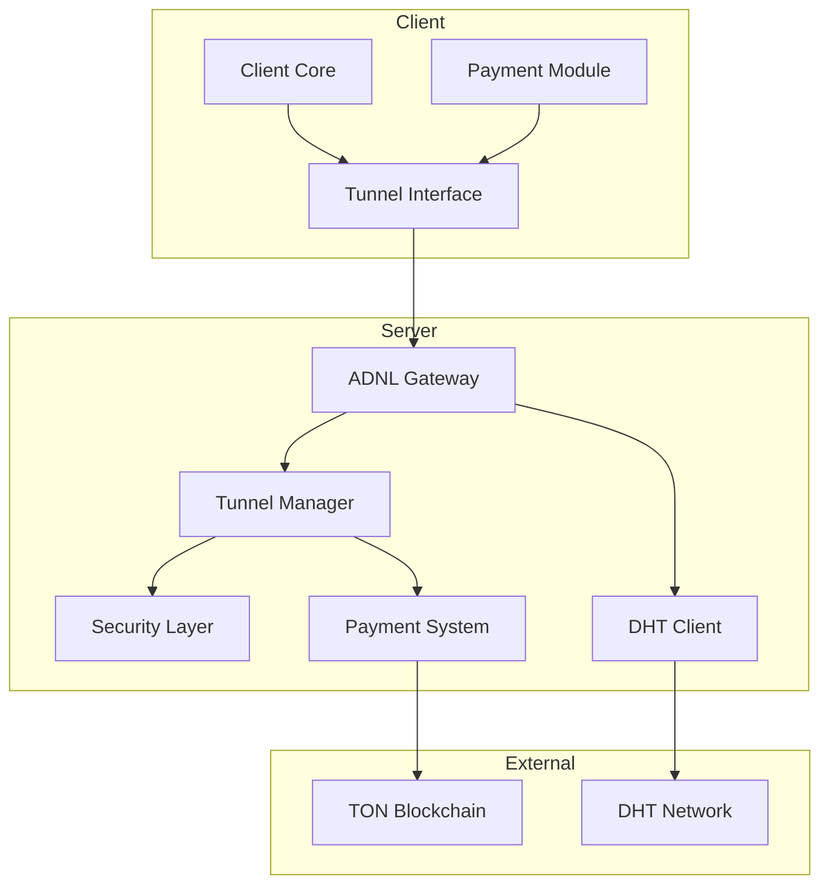
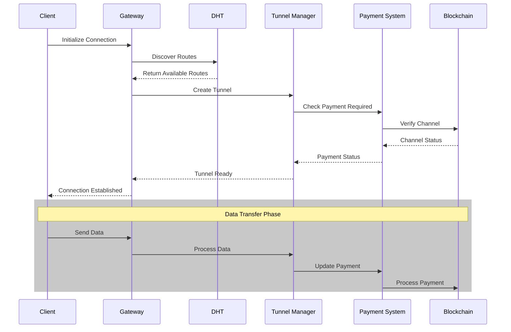
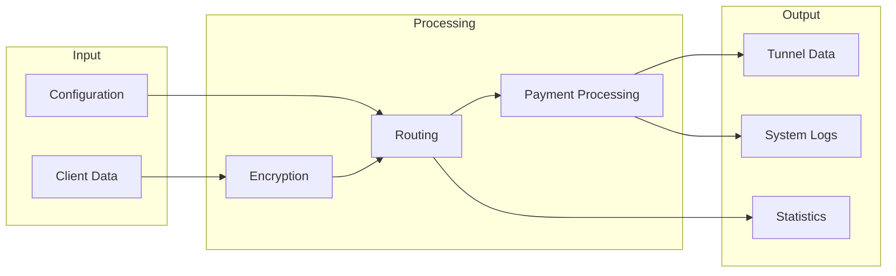

# ADNL Tunnel

A secure, decentralized tunneling service built on The Open Network (TON) blockchain, providing encrypted communication channels with integrated payment capabilities.


## Table of Contents
1. [Features](#features)
2. [System Architecture](#system-architecture)
3. [Prerequisites](#prerequisites)
4. [Installation](#installation)
5. [Configuration](#configuration)
6. [Usage](#usage)
7. [Technical Specifications](#technical-specifications)
8. [Security Considerations](#security-considerations)
9. [Performance Tuning](#performance-tuning)
10. [Troubleshooting](#troubleshooting)
11. [Development Guide](#development-guide)
12. [Contributing](#contributing)
13. [License](#license)
14. [Important Notes](#important-notes)
15. [Acknowledgments](#acknowledgments)
16. [Disclaimer](#disclaimer)

## Features

- **Secure Communication**: Implements ADNL (Abstract Datagram Network Layer) protocol for encrypted data transmission
- **Decentralized Architecture**: Utilizes TON blockchain's DHT for node discovery
- **Payment Integration**: Built-in TON payment channels for service monetization
- **Garlic Routing**: Multi-layer encryption for enhanced privacy
- **Dynamic Routing**: Automatic route optimization and load balancing
- **External IP Support**: Ability to serve as an exit node with white IP address
- **DDoS Protection**: Built-in rate limiting and protection mechanisms
- **Cross-Platform Support**: 
  - Linux (amd64, arm64)
  - macOS (amd64, arm64)
  - Windows (amd64)
  - BSD systems

## System Architecture

### Overview
The ADNL Tunnel implements a multi-layer architecture:
1. **Transport Layer**: ADNL protocol implementation
2. **Routing Layer**: DHT-based node discovery and routing
3. **Payment Layer**: TON blockchain integration
4. **Security Layer**: Encryption and access control

### Architecture Diagrams

#### Component Diagram



#### Sequence Diagram



#### Data Flow Diagram



### Communication Flow

1. Client initiates connection
2. Route discovery and optimization
3. Payment channel establishment (if enabled)
4. Encrypted tunnel creation
5. Data transmission with payment tracking

## Prerequisites

- Go 1.20 or higher
- TON Wallet (if using payment features)
- External IP address (optional, for exit nodes)
- Open ports for tunnel and payment services

## Installation

1. Clone the repository:
```bash
git clone https://github.com/ton-blockchain/adnl-tunnel.git
cd adnl-tunnel
```

2. Build the project:
```bash
go build
```

## Configuration

The configuration file (`config.json`) will be automatically generated on first run. Here's a sample configuration:

### Configuration File Locations

- Default: `./config.json` (in the current working directory)
- Linux/macOS: `$HOME/.config/adnl-tunnel/config.json`
- Windows: `%APPDATA%\adnl-tunnel\config.json`

You can override the default location using the `-config` flag.

```json
{
  "TunnelServerKey": "<auto-generated>",
  "TunnelListenAddr": "0.0.0.0:17330",
  "TunnelThreads": 4,
  "NetworkConfigUrl": "https://ton-blockchain.github.io/global.config.json",
  "ExternalIP": "",
  "Payments": {
    "Enabled": false,
    "PaymentsServerKey": "<auto-generated>",
    "WalletPrivateKey": "<auto-generated>",
    "PaymentsListenAddr": "0.0.0.0:17331",
    "DBPath": "./payments-db/",
    "SecureProofPolicy": false,
    "ChannelConfig": {
      "VirtualChannelProxyFee": "0.01",
      "QuarantineDurationSec": 600,
      "MisbehaviorFine": "0.15",
      "ConditionalCloseDurationSec": 180
    },
    "MinPricePerPacketRoute": 1000,
    "MinPricePerPacketInOut": 1000
  }
}
```

### Configuration Parameters

- `TunnelServerKey`: ED25519 private key for the tunnel server
- `TunnelListenAddr`: Address to listen for tunnel connections
- `TunnelThreads`: Number of worker threads (defaults to CPU count)
- `NetworkConfigUrl`: TON network configuration URL
- `ExternalIP`: External IP address (if available)
- `Payments`: Payment system configuration
  - `Enabled`: Enable/disable payment system
  - `PaymentsListenAddr`: Address for payment service
  - `SecureProofPolicy`: Use secure proof checking policy
  - `MinPricePerPacketRoute`: Minimum price per packet for routing
  - `MinPricePerPacketInOut`: Minimum price per packet for in/out operations

## Usage

### Starting the Server

1. Basic start:
```bash
./adnl-tunnel
```

2. With custom configuration:
```bash
./adnl-tunnel -config=custom_config.json
```

3. With verbose logging:
```bash
./adnl-tunnel -v=3
```

### Client Usage Examples

```bash
# Basic client connection
./adnl-tunnel -node <server-adnl-id>

# With custom configuration
./adnl-tunnel -config custom_config.json -node <server-adnl-id>
```

### Command Line Arguments

- `-config`: Path to configuration file (default: "config.json")
- `-payment-node`: Payment node to open channel with (optional)
- `-v`: Verbosity level (0-5, default: 2)
  - 0: Error
  - 1: Warning
  - 2: Info
  - 3: Debug
  - 4: Trace
  - 5: DHT Debug

### Runtime Commands

The following commands are available while the tunnel is running:

- `balance`: Check current TON balance in payment channels
- `capacity`: Check remaining capacity in payment channels

## Technical Specifications

### Protocol Details

- **ADNL Protocol Version**: 1.0
- **Encryption**: ED25519 + AES-256-GCM
- **DHT Protocol**: Kademlia-based
- **Network Layer**: UDP
- **Maximum Packet Size**: 2048 bytes
- **Default Port Range**: 17330-17331

### Performance Metrics

- **Maximum Connections**: Based on system resources
- **Throughput**: Up to network capacity
- **Latency Overhead**: ~10-20ms per hop
- **Payment Processing Time**: ~2-5 seconds
- **DHT Lookup Time**: ~1-2 seconds

### System Requirements

#### Minimum Requirements
- CPU: 2 cores
- RAM: 2 GB
- Storage: 1 GB
- Network: 10 Mbps

#### Recommended Requirements
- CPU: 4+ cores
- RAM: 4+ GB
- Storage: 10+ GB
- Network: 100+ Mbps
- External IP address

### Supported Platforms

| OS | Architecture | Status |
|----|-------------|---------|
| Linux | amd64 | ✅ Stable |
| Linux | arm64 | ✅ Stable |
| macOS | amd64 | ✅ Stable |
| macOS | arm64 | ✅ Stable |
| Windows | amd64 | ⚠️ Beta |
| BSD | amd64 | ⚠️ Beta |

## Security Considerations

- All private keys are stored locally
- Multi-layer encryption for all communications
- Rate limiting for DDoS protection
- Secure payment channels
- Optional secure proof policy for payments
- Regular security audits recommended
- Firewall configuration guidelines available

## Performance Tuning

- Adjust `TunnelThreads` based on server capacity
- Configure appropriate rate limits
- Monitor channel capacity and balance
- Optimize payment channel parameters
- Network buffer size optimization
- Connection pooling settings

## Troubleshooting

Common issues and solutions:

1. Connection Failed
   - Check network configuration
   - Verify external IP settings
   - Ensure ports are open
   - Check firewall rules
   - Verify DHT connectivity

2. Payment Issues
   - Verify wallet balance
   - Check payment channel status
   - Confirm minimum price settings
   - Validate blockchain connectivity
   - Check payment node availability

3. Performance Problems
   - Adjust thread count
   - Monitor system resources
   - Check network capacity
   - Optimize route selection
   - Review logging levels

## Development Guide

### Project Structure

```
adnl-tunnel/
├── config/         # Configuration management
├── tunnel/         # Core tunnel implementation
│   ├── gateway.go  # ADNL gateway
│   ├── section.go  # Tunnel sections
│   └── payment.go  # Payment integration
├── main.go        # Entry point
└── docs/          # Documentation
```

### Building from Source

1. Install dependencies:
```bash
go mod download
```

2. Run tests:
```bash
go test ./...
```

3. Build:
```bash
go build -o adnl-tunnel
```

### Development Setup

1. Install development tools:
```bash
# Install golangci-lint
curl -sSfL https://raw.githubusercontent.com/golangci/golangci-lint/master/install.sh | sh -s -- -b $(go env GOPATH)/bin

# Install mockgen
go install github.com/golang/mock/mockgen@latest
```

2. Set up pre-commit hooks:
```bash
git config core.hooksPath .githooks/
chmod +x .githooks/pre-commit
```

### Code Style

- Follow [Effective Go](https://golang.org/doc/effective_go) guidelines
- Use `gofmt` for code formatting
- Maximum line length: 100 characters
- Add comments for exported functions and types

### Testing

- Write unit tests for new features
- Maintain test coverage above 80%
- Use table-driven tests when appropriate
- Mock external dependencies

### Debugging

1. Enable debug logging:
```bash
./adnl-tunnel -v=5
```

2. Use pprof for profiling:
```bash
# CPU profile
go tool pprof http://localhost:6060/debug/pprof/profile

# Memory profile
go tool pprof http://localhost:6060/debug/pprof/heap
```

### Common Development Tasks

1. Adding a new command:
   - Add command handler in `main.go`
   - Update command documentation
   - Add unit tests

2. Modifying tunnel behavior:
   - Update relevant files in `tunnel/` package
   - Consider backward compatibility
   - Update tests and documentation

3. Changing configuration:
   - Modify `config/config.go`
   - Update sample configuration
   - Update configuration documentation

## Contributing

1. Fork the repository
2. Create your feature branch
3. Commit your changes
4. Push to the branch
5. Create a Pull Request

## License

This project is licensed under the MIT License - see the LICENSE file for details.

## Important Notes

> ⚠️ **Implementation Status**: Some features described in this documentation are planned but not yet fully implemented. Please check the source code or open issues for the latest implementation status.

## Acknowledgments

- TON Blockchain team
- TON Payment Network contributors
- ADNL protocol developers
- Open source community

## Disclaimer

This software is provided "as is", without warranty of any kind. Use at your own risk.
Users are responsible for ensuring compliance with local laws and regulations.
